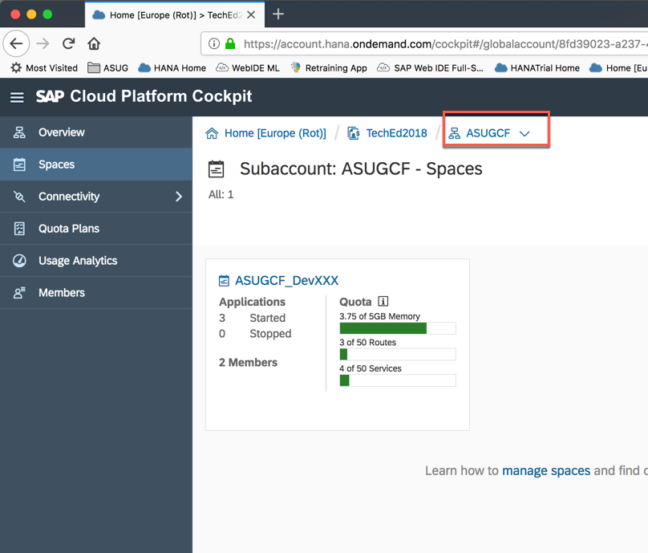
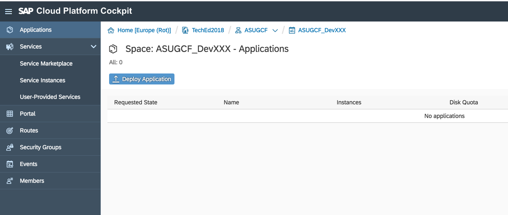
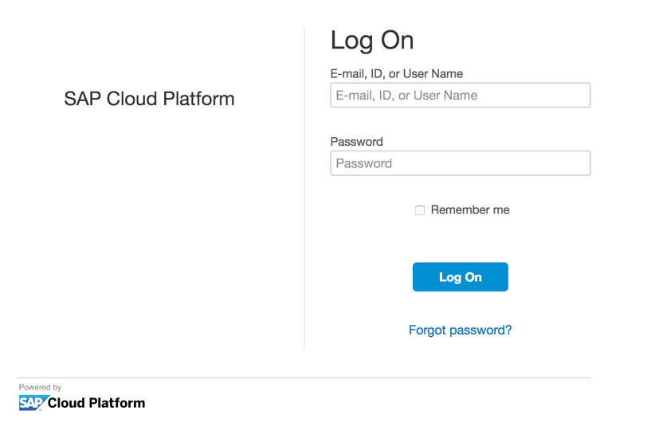

<table width=100% border=>
<tr><td colspan=2></td></tr>
<tr><td colspan=2><h1>EXERCISE 1 - Create service destinations on both SAP Cloud Platform Neo and Cloud Foundry environments</h1></td></tr>
<tr><td><h3>ASUG PreConference 2018</h3></td><td><h1> &nbsp;60 min</h1></td></tr>
</table>

## Description
In this exercise, you’ll learn how to 

* create a XSUAA service instance in SAP Cloud Foundry
* create a Destination service instance in SAP Cloud Foundry and import the required destination 

## Target group

* Developers
* People interested in learning the SAP Cloud Platform Application Programming Model  

## Goal

The goal of this document is to set up some required services for the next exercises.  

## Prerequisites
  
Here below are prerequisites for this exercise.

* An account on the SAP Cloud Platform: it will be provided by your instructor along with the required credentials
* The destination file you can download [here](files/ErpQueryEndpoint_CF.zip). Extract it in a proper location on your disk

## Steps

1. [Create the XSUAA and the destination services on SAP CF and check the Neo environemnt](#xsuaa-destination)

### Create the XSUAA and the destination services on SAP CF and check the Neo environemnt
In this chapter you are going to see how to create a couple of services instances(XSUAA, destination) on SAP Cloud Foundry and how to import a destination file into the destination instance.

1. Login to SAP Cloud Platform <https://account.hana.ondemand.com/cockpit#/globalaccount/8fd39023-a237-4d71-9b6a-ed9d1719d275/subaccounts> with the credentials provided by your instructor 
	

1. You will find two environments prepared for you: **ASUG** and **ASUGCF**. The first one, **ASUG**, is your SAP CP Neo environment and the other one, **ASUGCF**, is your SAP Cloud Foundry environment. Let's start with Cloud Foundry. Click on the **ASUGCF** tile  
	

1. Take note of the **API Endpoint** you find on the right side because it will be required in the next exercises when we will ask you to specify your SAP Cloud Foundry API Endpoint and click on **Spaces**  
	

1. Locate the space named **ASUGCF_DevXX** where **XX** is your **workstation ID** provided by your instructor and click on it  
	

1. Click on **Service Marketplace** and choose the **Authorization & Trust Management** tile  
	

1. Select **Instances** on the left hand side and click on the **New Instance** button to create a new instance of this XSUAA service  
	

1. Select the **application** plan and click **Next**  
	

1. Click **Next**  
	

1. Just click **Next** again  
	

1. Enter **bpr_xsuaa** as the instance name and click **Finish**  
	

1. Your XSUAA instance has been successfully created. Click on the **ASUGCF_DevXX** link on the toolbar to go back to your space  
	

1. Click again on the **Service MArketplace** to create an instance of the **destination** service  
	

1. Click on **Instances** and then on **New Instance**  
	

1. Choose the **lite** plan and click **Next**  
	

1. Click **Next**  
	

1. Don't select any application for the moment and click **Next** again  
	

1. Enter **bpr_destination** as the instance name and click **Finish**  
	

1. Your **bpr_destination** instance has been successfully created. Click on the name of this instance  
	

1. Select the **Destinations** tab on the left hand side and click on **Import Destination**  
	

1. Locate the file *ErpQueryEndpoint_CF* you extracted from the zip downloaded in the prerequisites to this exercise  
	

1. The file will be imported. Just enter the credentials provided by your instructor and click **Save**  
	

1. After saving, you can check the new destination by clicking on the button **Check Connection**  
	

1. You should get the message **Connection to "ErpQueryEndpoint"" established. Response returned: "302: Redirect"**. Click on **Close**  
	

1. Go back to your Global Account by clicking on the **TechEd2018** link on the top of the page
	

1. This time select the **ASUG** subaccount which corresponds to your **SAP Neo** environment 
	

1. Select **Connectivity -> Destinations** on the left hand side and just make sure that the **ErpQueryEndpoint** destination is correctly in place. Here we have already imported this destination since all the users will share it in the next exercises
	

1. Finally, click on **Services**, enter the text "**web**" in the search box, and click on the **SAP Web IDE Full-Stack** tile  
	

1. Click on **Go to Service**  
	

1. The **SAP Web IDE** tools is launched. Please bookmark this URL becaue it will be used in the next exercises  
	

1. Congratulations! You have successfully completed this exercise.

## Summary
This concludes the exercise. You should have learned how to create a XSUAA service instance in SAP Cloud Foundry and a Destination service instance in SAP Cloud Foundry. Please proceed with the next exercise.
