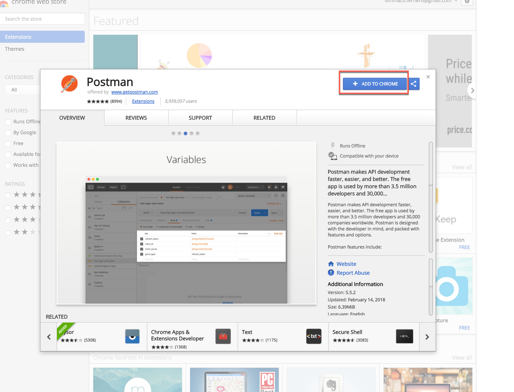

<table width=100% border=>
<tr><td colspan=2></td></tr>
<tr><td colspan=2><h1>PREREQUISITES</h1></td></tr>
<tr><td><h3>ASUG PreConference 2018</h3></td><td><h1> &nbsp;5 min</h1></td></tr>
</table>

## Description
In this exercise, you’ll go through the basic steps of setting up the development environment required for ASUG PreConference 2018 hands on.

## Target group

* Application Developers
* People interested in learning about 
	- S/4HANA Cloud extension and SDK
	- Application Programming Model

## Goal

The goal of this document is to have your workstation or laptop well prepared for the **ASUG PreConference 2018** hands on.

## Prerequisites
  
Here below are prerequisites required for the exercises in this session.

1. [Bring Your Own Laptop with Admin Access](#laptop)
1. [Install Chrome Postman application](#postman)

###  Bring Your Own Laptop with Admin Access
 
Please bring the laptop that you have admin access for hands-on exercises.  You will need the admin right to setup the development environment for the exercises by installing or updating the software or configuring the setup.

###  Install Chrome Postman application
For the workshop exercises you need to install the **Postman** application for Chrome. It will allow you to send REST requests to backend systems. Please pay attention that, this kind of application has been deprecated and removed from the Chrome web store, because it has been converted to a stand-alone application. However, for the scope of these exercises you will need to install it as a Chrome app. You can open the following link to install it:

<https://chrome.google.com/webstore/detail/postman/fhbjgbiflinjbdggehcddcbncdddomop>  
	

## Summary
You have successfully completed the prerequisites installation.
